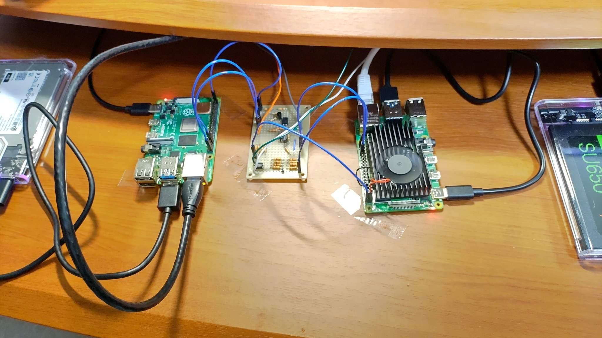

# Machine Status Api
RaspberryPiのGPIOを使用した物理マシンの操作や、ProxmoxVEの仮想マシンの管理をREST API経由で行えるようにするプログラムです。

## Getting Started

### 回路を作成する
がんばっていい感じにしてください。
回路図

回路写真
[](https://twitter.com/walnuts1018/status/1628759384414367751)

### 環境変数設定
|env|sample|detail|
| --- | --- | --- |
|GIN_MODE|release|gin用release mode設定|
|PVE_API_URL|https://proxmox.walnuts.dev/api2/json/|ProxmoxのAPI Endpoint|
|PVE_API_TOKEN_ID|user@pam!machine-status-api|Proxmox API Token ID|
|PVE_API_SECRET|******************|Proxmox API Secret|
### Start with Docker
対応arch: `arm64`
```bash
docker run -p 8080:8080 ghcr.io/walnuts1018/machine-status-api:latest
```

### Kubernetes Manifest Sample

To: [./.k8s](./.k8s)
